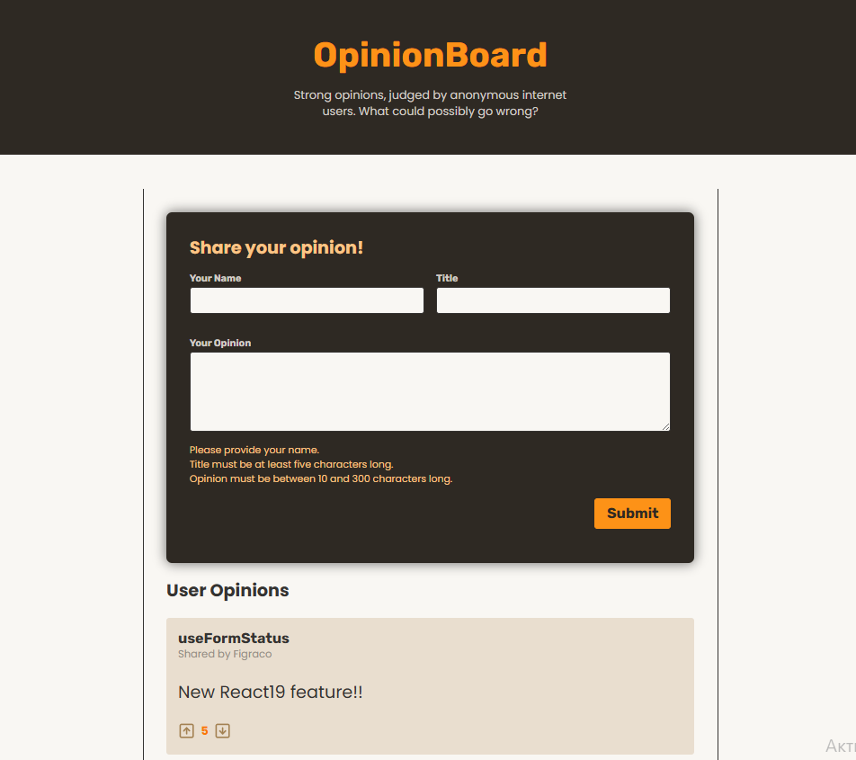

# 🗣️ OpinionBoard

**OpinionBoard** is a full-stack React + Express application that allows users to share, upvote, and downvote opinions in real time.  
It demonstrates the power of **React 19 form actions**, **context-based state management**, **optimistic UI updates**, and **Express.js backend integration**.

---

## 📜 Description

This project showcases a complete, modern workflow for handling user input, validation, and HTTP communication between frontend and backend.  
It is designed to illustrate practical usage of React’s new form features (`useActionState`, `useFormStatus`, `useOptimistic`, and `use`) combined with server-side persistence via a Node/Express API.

---

<h3 align="center">📸 Project Preview</h3>

   
  <em>Example of form validation and controlled inputs</em>

   
  <em>Reusable input components and validation logic in action</em>

---

## ⚙️ Key Features

### 🧠 Frontend (React 19)
- **Form handling with `useActionState`** — declarative validation and controlled submissions.
- **Async feedback with `useFormStatus`** — dynamically disables buttons and shows "Submitting..." states.
- **Context-based global state (`OpinionsContext`)** — shared opinions, upvotes, and downvotes across components.
- **Optimistic UI updates (`useOptimistic`)** — immediate visual feedback before server confirmation.
- **Declarative async actions (`formAction`)** — each form or button triggers its own async logic directly.

### 🌐 Backend (Node.js + Express)
- RESTful API for opinions:  
  - `GET /opinions` → Fetch all opinions  
  - `POST /opinions` → Add a new opinion  
  - `POST /opinions/:id/upvote` → Increment votes  
  - `POST /opinions/:id/downvote` → Decrement votes  
- Data persistence via a local `db.json` file.
- Simulated network latency for realistic async testing.
- CORS-enabled for local frontend communication.

### 🧩 React Hooks Used
| Hook | Purpose |
|------|----------|
| `useActionState` | Handles form submission and validation logic |
| `useFormStatus` | Tracks async submission state for UI feedback |
| `useOptimistic` | Implements temporary optimistic UI updates |
| `use` | Accesses React context without extra wrappers |
| `useEffect`, `useState` | Fetches and manages backend data |

---

## 🧩 Architecture Overview
<pre>
📁 OpinionBoard
├── backend/
│   ├── app.js                 # Express.js backend server with REST API (GET, POST, upvote, downvote)
│   ├── db.json                # Local JSON database storing all opinions
│   ├── package.json           # Backend dependencies and start script
│   └── package-lock.json      # Dependency lockfile
│
├── public/                    # Static public assets (served by Vite)
│
├── src/
│   ├── components/            # React UI components
│   │   ├── Header.jsx         # Application header and tagline
│   │   ├── NewOpinion.jsx     # Form for submitting new user opinions
│   │   ├── Opinion.jsx        # Individual opinion card with votes
│   │   ├── Opinions.jsx       # Renders list of all opinions
│   │   └── Submit.jsx         # Form submit button using useFormStatus
│   │
│   ├── store/                 # Global state management via React Context
│   │   └── opinions-context.jsx  # Provides and manages opinions, votes, and async actions
│   │
│   ├── App.jsx                # Root application component (context + routing)
│   ├── main.jsx               # Entry point for React DOM rendering
│   ├── index.css              # Global styling
│   └── vite.config.js         # Vite configuration
│
├── index.html                 # Root HTML file
├── package.json               # Frontend dependencies and scripts
├── package-lock.json          # Frontend dependency lockfile
└── .eslintrc.json             # ESLint configuration
</pre>
